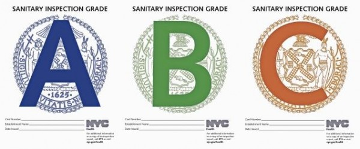
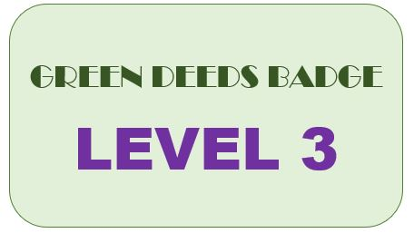
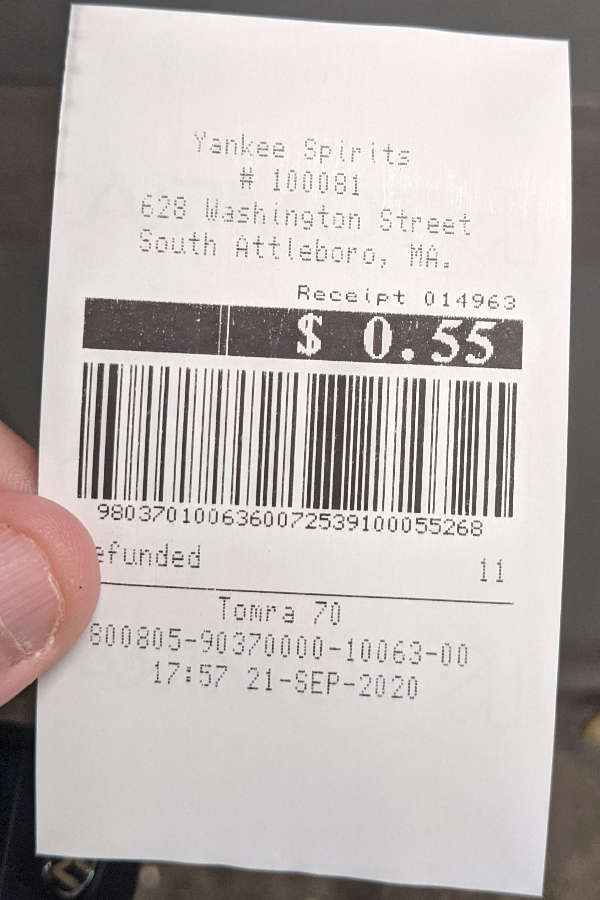
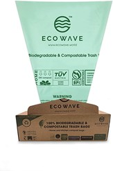
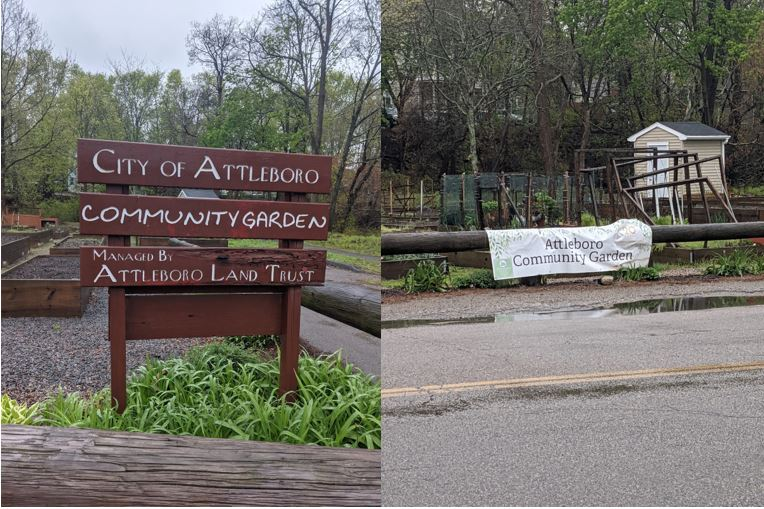
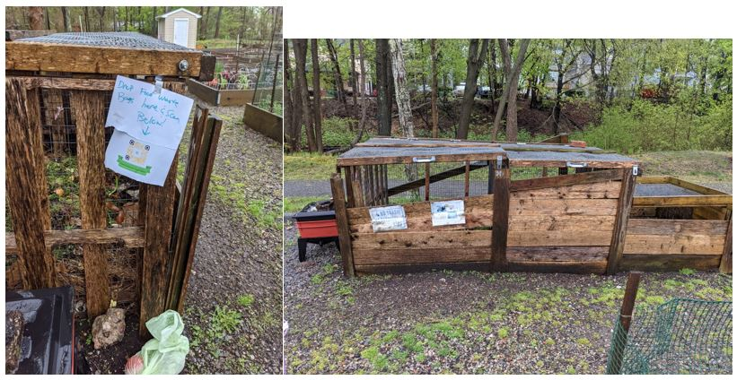
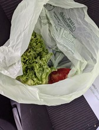
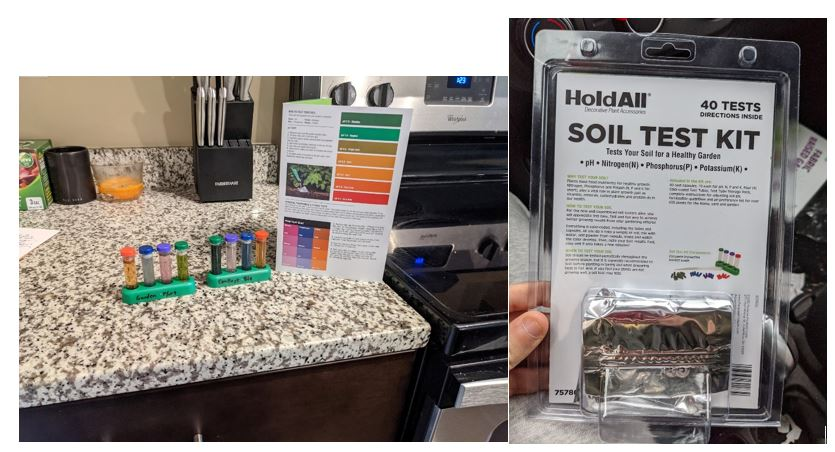

# Green Deeds Regen Integration with IRISnet NFTs

## The Green Deeds Vision:

- Green Deeds users are immediately rewarded for their green deeds with Celo Dollars 
- Users can choose to invest their earnings in the crypto market by converting to CELO or exchanging for any other ERC-20 token.
  - A demo of this concept can be found here: 
- After a certain amount of green deeds, users are rewarded with an NFT badge proving their direct impact on the environment. 
- Once users have earned an eco-credit backed badge, they can see their impact on the environment by clicking the “see your impact” button on their profile page.   
- Small businesses, proud of their eco-credit backed NFTs, post their badges on their website to share their ecological impact and expand awareness to their customers.  
- Composting and recycling businesses integrate into the Green Deeds system and implicitly join Regen’s network of Ecological State Providers, creating a new class of Ecological State Protocols for green stewards who may not own land. 


## What is Green Deeds?
- Link to our [demo](https://youtu.be/v4Md0cnpEx4) with NFT integration.

- Link to our full [presentation](https://www.youtube.com/watch?v=IKhEv0-V1wc).

- Link to our [demo](https://youtu.be/NjBQ16nf4D8) for Celo, mobile-first, integration.

- Link to proof of concept for IRISnet [NFT integration](./irisnet-nft.md).


Green Deeds incentivizes individuals and businesses to recycle and compost by rewarding their green deeds immediately with [Celo](https://celo.org/) cash. We believe our mission directly coincides with Regen Networks, as we aim to bring ecological awareness to society by incentivizing deeds that directly give back to the environment.  Coordinating our efforts with Regen Network would allow a centrality of knowledge for ecological service providers, stewards, small businesses and individuals. 

Our NFT feature aims to incentivize our users by rewarding them with NFTs after a certain amount of green deeds are done.  NFTs backed with tokenized carbon credits is the best way for our users to see the impact their actions have on our climate, and expands the ecological social system Regen Network desires to build.

Our vision is to create a badge system, similar to restaurant sanitation grading systems seen posted in food stores throughout the US (Fig. 1).  



Fig. 1 – Sanitary Inspection Grades


Green Deeds NFTs (Fig. 2) will represent our end users’ ecological impact over time by providing badges as they do more green deeds. The main difference is that there are no bad grades with Green Deeds badges as there might be with sanitation grades.  This helps promote positive regenerative narratives to our users at all times.



Fig. 2 - Example of a Green Deeds NFT Badge

#
## How we'll integrate

Green Deeds already ensures accuracy and truth-telling by utilizing existing infrastructure in recycling and composting industries.  Our app recognizes receipts from well-known recycling machines and composting non-profits (Fig. 3).



When a user uploads a receipt from these partners, our app validates the receipts and rewards users for their deed.  Please watch our [demo video](https://youtu.be/NjBQ16nf4D8) for a more in depth look at existing user flow.

Eventually, we hope to integrate existing recycling machines and composting non-profits into the Regen Network through the Regen Registry Program, so that these companies are rewarded for being a part of the Green Deeds system.

Not only that, but it allows us to incorporate the data from recycling machines and composting companies in the Green Deeds system into the Regen Network.  That way we can add an additional metadata parameter to our badges that includes all transactions on regen ledger that are a direct result of our end users green deeds.  This also allows us to incorporate education and awareness into the Green Deeds application with Regen Ledger’s Data Module.  If badges correlate to specific ledger transactions and contain the deeds in the content, we can help users visualize their individual impact on the ecosystem.  


## Issuing NFTs for Green Deeds

To start building our vision, we want to create three levels of badges, all backed by eco-credits.  Level one will be backed by less eco-credits than the third, as the end user has done less green deeds and their ecological impact is less. 

Green Deeds will issue NFTs using IRISnet to users who have reached milestones in their regeneration efforts.  These NFTs will be a direct result of their impact on society.  The application rewards a user with a certain NFT badge based on the amount of deeds done.  The Green Deeds app will handle the logic for choosing which level a user has earned and a transaction will be called to mint a new badge for the recipient based on NFT models already issued to IRISnet.  

We were able to create a mock version of our NFT on an IRISnet local node.  More details on that experience can be found [here](./irisnet-nft.md).

IRISnet Screenshots:
- [All badges issued to IRISnet local node](./image/readme/allbadgesissued.jpg)

- [Level one badge minted to IRISnet local node](./image/readme/mintlevelone.jpg)

## Development of a new Credit Class for "Green Stewards"

The Green Deeds system uses existing recycling machines and composting companies to prove our end users have done a green deed.  Creating a new Regen Credit Class for these partners would create a fully decentralized system where both the individual and the businesses have incentive for regenerating the ecosystem and providing data for those efforts.  These recycling machiens and composting companies can be thought of as "Green Stewards", ecological stewards who do not own land. 

Green Deeds provides all the requirements for a Regen Registry review for a Credit Class already. ([Section 11.1](https://www.google.com/url?q=https://regen-registry.s3.amazonaws.com/Regen%2BRegistry%2BProgram%2BGuide.pdf&sa=D&source=editors&ust=1620244405466000&usg=AOvVaw1eRa__WAib8m4fkcXAgPZQ))

````
11.1.1.1.   Market analysis demonstrating potential for GHG removal or improvement in other relevant ecological indicators by the proposed activity.
````
- Green Deeds is a mobile application that makes recycling and composting that much more desirable for individual people through instant rewards.

```` 
11.1.1.2.   An analysis of the ability and timing to scale impact given geographic,
regulatory or other pertinent considerations.
````
- There is cause to believe individuals and small businesses will want to use the services with our instant Celo rewards.

````
11.1.1.3.   Sample project using (or planning to use) the proposed Credit Class
including an economic analysis demonstrating that the proposed
activity is viable under current market conditions.
````

-  Because our concept works without being backed by ecocredits, we can demonstrate potential for ecological impact with these services as soon as our app launches.

Please see the [second section](https://youtu.be/v4Md0cnpEx4?t=160) of our NFT demo video for additional info.


### How does it work for [food waste](./foodwaste.md)?

A user starts by sorting their acceptable food waste into compostable bags.



Then drop these bags off at the composite site of a local community garden. 



The user scans the unique QR code found at the site to validate their drop off.



A community garden volunteer acts as a validator and verifies that the food being recycled into the first stage of the local compost bin is acceptable. If any flaws are detected it is removed. 



Over time, as more and more user food waste is added to the community garden's compost system, as another validator operation, a community garden volunteer also is tasked with sampling both the soil of each plot that the compost is being donated for in order to ensure quality.

The soil sample quality is recorded on the Regen Network.



#
## Conclusion

Green Deeds provides an interface for individuals to prove their ecological impact and be instantly rewarded for those deeds.  Every deed is recorded on a blockchain ledger, which provides our end users with a permanent ledger of their ecological impact.  As of now, users are rewarded and their efforts recorded solely on the Celo blockchain.   

To further incentivize our users to recycle or compost, our NFT feature will be implemented using Regen Networks eco-credits.  This not only rewards our end users with a permanent badge and proof of their green deeds, but also allows them to see how their efforts are directly impacting their environment.  Further, their actions are permanently recorded on the Regen Ledger, which provides a second ledger for proof of our users’ work.  We hope these badges eventually reach a standard similar to that of sanitary grades posted in restaurants around the US, so businesses can market their regeneration efforts to potential customers.


#
## Sources

- [Regen Network Economics Technical Paper](https://regen-network.gitlab.io/whitepaper/Economics.pdf)

- [Regen Registry Program Guide](https://regen-registry.s3.amazonaws.com/Regen+Registry+Program+Guide.pdf)

- [Green Deeds Pitch](https://www.youtube.com/watch?v=IKhEv0-V1wc)

- [Celo User Flow](https://youtu.be/NjBQ16nf4D8)

- [NFT User Flow](https://youtu.be/v4Md0cnpEx4)

- [IRISnet NFT integration](./irisnet-nft.md)

- [How it works for food waste](./foodwaste.md)

- [Celo](https://celo.org/)